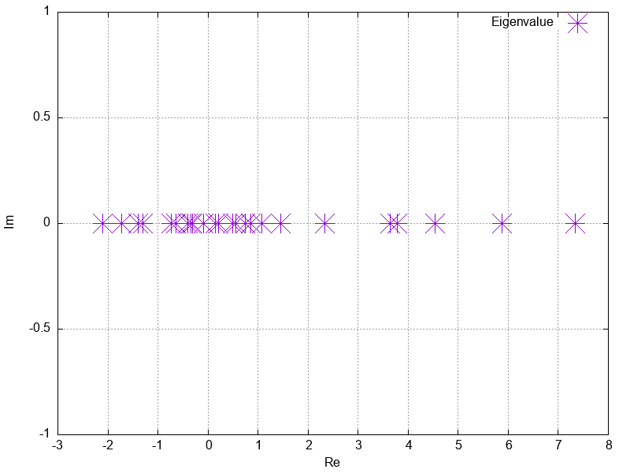
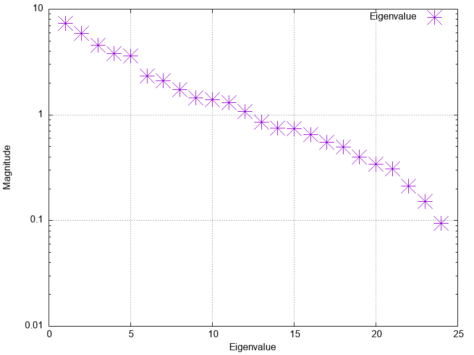
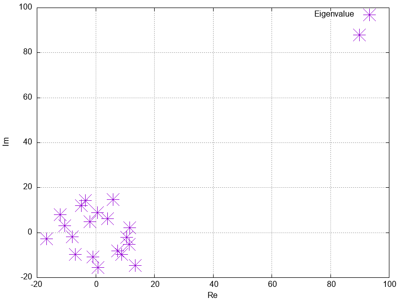
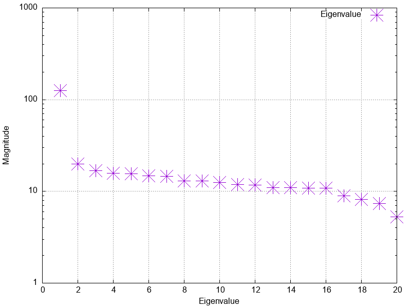

# Eigenvalue Computation Project

This repo contains the main project of the EPFL course Programming Concepts for Scientific Computing MATH-458.

This project is dedicated to the implementation of numerical methods for eigenvalue computation. It targets matrices `A` and focuses on finding all scalars `λ` (eigenvalues) that satisfy the equation:

$$ Ax = \lambda x $$

The project includes the implementation of the follower solvers in order to solve the problem:

1. **Power Method**: 
   - This method is used to find the dominant eigenvalue of a matrix.

2. **Inverse Power Method**:
   - A technique for finding the smallest eigenvalue of a matrix.

3. **Power and Inverse Power Methods with Shift**:
   - An enhancement of the basic methods, incorporating a shift to accelerate convergence and find eigenvalues that are not in the extreme of the spectrum.

4. **QR Method**:
   - An algorithm to compute all eigenvalues of a matrix by decomposing it into a product of an orthogonal matrix `Q` and an upper triangular matrix `R`.

## Cloning the repository

When cloning the repository to a new location, you should initialize and fetch the submodules:

```bash
git clone --recursive https://github.com/pauromeu/eigenvalue-pcsc.git
```

Or, if the repository is already cloned:

```bash
git submodule update --init --recursive
```

## Building the Project

### Prerequisites
Before building, ensure you have the following installed:
1. CMake (version 3.10 or higher)
2. A C++ compiler compatible with CMake (GCC, Clang, MSVC, etc.)
3. Gnuplot (version 3.2 or higher)

This project also makes use of depencies included as submodules. No need to manually install them.

1. Eigen: A C++ template library for linear algebra.
2. Google Test: A C++ testing framework for unit testing.

### Building Instructions

   Run the following command in the root directory of the project to create a build directory and generate the necessary build files:
   ```bash
   cmake -S . -B build
   ```
   Build the files in the build folder:
   ```bash
   cmake --build build
   ```

### Running the project

   After a successful build, you can find the executable in the build directory. Navigate there and run it. Learn ho to use it in the 
   
   ```bash
   cd build
    ./Eigenvalue-PCSC --matrix=<matrix> --solver=<solver>
   ```

   In the same directory, run the executable generated to run the tets:
   ```bash
    ./Eigenvalue-PCSC-tests
   ```

## How to use the program?

As explained in the [introduction](#eigenvalue-computation-project), the project implements 5 methods to obtain the eigenvalues and the eigenvectors of a matrix. The following summary table can guid the user to know which method to use depending on its requirements.

| Method                        | # Eigenvalues | # Eigenvectors | Real Matrix Support | Complex Matrix Support | Example Usage                            |
| ----------------------------- | ------------- | --------------- | ------------------- | ----------------------- | ----------------------------------------- |
| Power Method                  | 1             | 1               | ✅                  | ✅                      | [Example 1](#1-find-the-largest-eigenvalue-and-its-associate-eigenvector-of-a-matrix)              |
| Inverse Power Method          | 1             | 1               | ✅                  | ✅                      | [Example 1](#1-find-the-largest-eigenvalue-and-its-associate-eigenvector-of-a-matrix)      |
| Shifted Power Method          | Multiple*      | Multiple*        | ✅                  | ✅                      | [Example 3](#3-shifting-to-get-other-eigenvectors)      |
| Shifted Inverse Power Method  | Multiple*      | Multiple*        | ✅                  | ✅                      | [Example 3](#3-shifting-to-get-other-eigenvectors) |
| QR Method                     | All      | ❌        | ✅                  | ✅                      | [Example 2](#2-finding-all-eigenvalues-of-a-matrix)               |

### Program Workflow

1. **Input Data**:
   - Place the matrix for which you want to compute eigenvalues and eigenvectors inside the folder `data/matrix/`.
   - Currently, the program supports matrices in the `.mtx` format.

2. **Running the Solver**:
   - The solver is executed through the command line interface.
   - You need to specify both the `matrix` and the `solver` you want to use.
   ```bash 
    build/Eigenvalue-PCSC --matrix=<matrix> --solver=<solver>
   ```
   - Refer to the examples section below for detailed usage instructions.

3. **Output Results**:
   - The results are stored in the `results/` folder.
   - For each input matrix named `mat`, four main result files are provided:
     - `mat_eigenvalues.txt`: Contains the eigenvalue(s) of the matrix `mat`.
     - `mat_eigenvectors.txt`: Contains the eigenvector(s) of the matrix `mat`.
     - `mat_spectrum.png`: Presents a plot of the spectrum of the eigenvalue(s) of the matrix `mat`.
     - `mat_eigenvalues.png`: Presenta a plot of the eigenvalue(s) of `mat` in the complex plane.


### Solver paramaters options

The following table summarizes the arguments tha can be used for the solver.

| Flag              | Description                                                   | Compulsory | Default Value   | Example Usage                     |
| ----------------- | ------------------------------------------------------------- | ---------- | --------------- | ---------------------------------- |
| `--solver`    | Eigenvalue solver method to use.               | Yes        | -               | `--solver=pm`                        |
| `--matrix`     | Name of the matrix file inside `data/matrix` in `mtx` format.         | Yes        | -               | `--matrix=can_24`              |
| `--type`    | Type of solver used. Only two valid types: `real` and `complex`.      | No         | `real`   | `--type=complex`            |
| `--tol`    | Tolerance of the solver for convergence check. | No         | `1e-6`           | `--tol=1e-8`                           |
| `--shift`     | Shift value for Shifted Methods.                | For Shifted Methods         | `0.0`           | `--shift=1.0`                           |
| `--maxIter`      | Number of maximum iterations            | No         | 10000               | `--maxIter=1000`                               |


### Examples

In this section, some usage examples are provided. All examples use demonstration matrices that can be found inside the `data/matrix/` folder.

#### 1. Find the largest eigenvalue and its associate eigenvector of a matrix.

To find the dominant eigenvalue (the one with the maximum absolute value) we would use the **Power Method**. So, this is the command we would run from the root folder:

```bash
build/Eigenvalue-PCSC --matrix=can_24 --solver=pm
```

This is the simplest command we can write. We are specifying the only 2 compulsory commands: the matrix and the solver. After running this, the expected output are the files with the larger eigenvalue and its correspondant eigenvalue.

Similarly, we can find the smallest eigenvalue (in absolute value) and its associated vector. In this casae, we have to use **Inverser Power Method**.

```bash
build/Eigenvalue-PCSC --matrix=can_24 --solver=im
```


Once generated, you should be able to find them in the [results](results/) folder.


#### 2. Finding all eigenvalues of a matrix

The only method in our solver that allows you to obtain all eigenvalues at once is the **QR method**. In this section we present an example of how to use it for both real and complex matrices. However, this method will not provide the eigenvectors.

##### 2.1 Real matrix

We can continue with `can_24` matrix. Let's find all its eigenvalues at once:

```bash
build/Eigenvalue-PCSC --matrix=can_24 --solver=qr --maxIter=10000 --tol=1e-5
```

Note that in this case we added two optional arguments. We will get the plots of the eigenvalues in the complex plane and their spectrum.

<table>
  <tr>
    <td>
      
      <p align="center">
        <sup>Figure 1. Complex plane</sup>
      </p>
    </td>
    <td>
      
      <p align="center">
        <sup>Figure 2. Spectrum</sup>
      </p>
    </td>
  </tr>
</table>

Again, check the [results](results/) folder to get your solution.

##### 2.2 Complex matrix

For the complex case, we have to use an input complex matrix. Let's take `rand_complex` as example. 

**Important**: The solver type must be fixed to `complex` or an error will be raised.

```bash
build/Eigenvalue-PCSC --matrix=rand_complex --solver=qr --type=complex --maxIter=10000 --tol=1e-5
```

This is the result to obtain:

<table>
  <tr>
    <td>
      
      <p align="center">
        <sup>Figure 3. Complex plane</sup>
      </p>
    </td>
    <td>
      
      <p align="center">
        <sup>Figure 4. Spectrum</sup>
      </p>
    </td>
  </tr>
</table>

#### 3. Shifting to get other eigenvectors

Now, let's focus on a case were we want to obtain all the eigenvectors. Since we can't use QR method to obtain them. We need to get them one by one with the Shifted method (we are aware it's not ideal, but at least they can be obtained). Let's study the matrix `dum3`. This matrix is as follows:

$$ dum3 = 
\begin{bmatrix}
0 & 11 & -5 \\
-2 & 17 & -7 \\
-4 & 2 & -10.1 \\
\end{bmatrix}
$$

The eigenvalues and eigenvector are as follows:

$$
\begin{align*}
\lambda_1 &\approx \text{4.4082} & \quad v_1 &\approx \begin{bmatrix} 0.3352 \\ -0.4978 \\ -0.7998 \end{bmatrix} \\
\lambda_2 &\approx \text{1.7322} & \quad v_2 &\approx \begin{bmatrix} -0.1329 \\ -0.4274 \\ -0.8942 \end{bmatrix} \\
\lambda_3 &\approx \text{0.7596} & \quad v_3 &\approx \begin{bmatrix} 0.3643 \\ 0.4060 \\ 0.8380 \end{bmatrix}
\end{align*}
$$

So, let's find the three eigenvalues and the corresponding eigenvectors. We can use the **Power Method** to obtain the largest one.

```bash
build/Eigenvalue-PCSC --matrix=dum3 --solver=pm
```

Similarly, we can find the smallest by using the **Inverse Power Method**.

```bash
build/Eigenvalue-PCSC --matrix=dum3 --solver=pm
```

Finally, we can use any of the shifted methods to obtain the non-extreme eigenvalues. The shift must be close to the value of the target eigenvalue (closer than any other). In this case, we know the analytical value of `λ2` so we can use it just like that. We could use **QR method** to obtain this value. Let's use `shift=2.0`. So, the following command using **Inverse Power Method with Shift** (we could also use **Power Method with Shift**), will give us the second eigenvalue and its corresponding eigenvector.

```bash
build/Eigenvalue-PCSC --matrix=dum3 --solver=ims --shift=2.0
```

That's it! Now we have all the eigenvalues and eigenvectors of `dum3`.

### Tests
To test the algorithm, the following tests have been implemented:
#### Power Method (With Shift) (real matrix)
##### Matrix Setup:

The input matrix is set as:

$$ inputMatrix = 
\begin{bmatrix}
2 & 1  \\
1& 2  \\
\end{bmatrix}
$$

We set `tolerance = 1e-6` and `maxIter = 1000`.

We also set `shift = -5.0` when testing the shifted power method.

##### Test suites
- Test 1: We assert that the output eigenvalue is near to `3.0` with a tolerance of `1e-6`.
- Test 2: We assert that the cosine similarity between the output eigenvector and the expected eigenvector $\left(\frac{1}{\sqrt{2}}, \frac{1}{\sqrt{2}}\right)$ is near to `1.0` with a tolerance of `1e-6`.
- Test 3: We set `maxIteration=1` and assert that the `IterationLimitExceeded` exception is thrown.
- Test 4: We set an empty matrix as input and assert that the `InvalidInputException` exception is thrown.

#### Inverse Power Method (With Shift) (real matrix)

##### Matrix Setup:

The input matrix is set as:

$$ inputMatrix =
\begin{bmatrix}
5 & 2  \\
2& 6  \\
\end{bmatrix}
$$

We set `tolerance = 1e-6` and `maxIter = 1000`.

We also set `shift = -5.0` when testing the shifted power method.

##### Test suites
- Test 1: We assert that the output eigenvalue is near to `(11 - sqrt(17)) / 2` with a tolerance of `1e-6`.
- Test 2: We assert that the cosine similarity between the output eigenvector and the expected eigenvector $\left(\frac{-1 - \sqrt{17}}{4}, 1\right)$ is near to `1.0` with a tolerance of `1e-6`.
- Test 3: We set `maxIteration=1` and assert that the `IterationLimitExceeded` exception is thrown.
- Test 4: We set an empty matrix as input and assert that the `InvalidInputException` exception is thrown.


#### Power Method (With Shift) (complex matrix)

##### Matrix Setup:

The input matrix is set as:

$$ inputMatrix =
\begin{bmatrix}
3 & 3-2i  \\
3+2i& 2  \\
\end{bmatrix}
$$

We set `tolerance = 1e-6f` and `maxIter = 1000`.

We also set `shift = -5.0` when testing the shifted power method.

##### Test suites
- Test 1: We assert that the real part of output eigenvalue is near to `0.162865` with a tolerance of `1e-5`.
- Test 2: We assert that $A\mathbf{x} = \lambda\mathbf{x}$ both in real part and in imaginary part, where $\mathbf{x}$ is the output eigenvector and $\lambda$ is the output eigenvalue.


#### Inverse Power Method (With Shift) (complex matrix)

$$ inputMatrix =
\begin{bmatrix}
-2/7 & 3/7-2i/7  \\
3/7+2i/7 & -3/7  \\
\end{bmatrix}
$$

We set `tolerance = 1e-6f` and `maxIter = 1000`.

We also set `shift = -5.0` when testing the shifted power method.

##### Test suites
- Test 1: We assert that the real part of output eigenvalue is near to `3.0` with a tolerance of `1e-6`.
- Test 2: We assert that $A\mathbf{x} = \lambda\mathbf{x}$ both in real part and in imaginary part, where $\mathbf{x}$ is the output eigenvector and $\lambda$ is the output eigenvalue.


#### QR Method

$$ input matrix =
\begin{bmatrix}
2& 1  \\
1 & 2  \\
\end{bmatrix}
$$

We set `tolerance = 1e-6f` and `maxIter = 1000`.

#### Test suites
- Test 1: We assert that the first output eigenvalue is near to `3.0` with a tolerance of `1e-6`.


## Generating Documentation

To generate the project's documentation, follow these steps:

### Prerequisites
Ensure you have Doxygen installed:
- For installation instructions, visit [Doxygen's official website](http://www.doxygen.nl/download.html).

### Generating the Docs
1. **Navigate to the Documentation Directory**:
   If your Doxygen configuration file (`Doxyfile`) is located in a specific directory (e.g., `docs`), navigate to that directory:
   ```bash
   cd docs
   ```
2. **Run Doxygen**:
   Execute the following command to generate the documentation:
   ```bash
   doxygen Doxyfile
   ```

3. **Accessing the Documentation**:
   - After successful generation, the documentation will be available in the directory specified in the `OUTPUT_DIRECTORY` of your Doxyfile.
   - If no output directory is specified, it will be in the same directory as your Doxyfile.
   - Open the `index.html` file in a web browser to view the documentation.

## Issues, known problems and further improvements

### Algorithms

#### QR method

1. **Convergence Check**: The QR method's convergence check is not robust. The solver may fail to converge, yet the results may still be accurate. We need to implement a better convergence check mechanism.

2. **Handling Non-Square Matrices**: Currently, the QR method only works for square matrices. Enhancements are needed to make it compatible with non-square matrices.

3. **Eigenvector Retrieval**: The solver currently does not support retrieving eigenvectors, especially when dealing with complex matrices. Exploring ways to handle complex matrices and retrieve eigenvectors could be beneficial.

4. **Performance**: The QR method can be slow for moderately sized matrices. We consider exploring techniques like parallelization or leveraging matrix properties such as sparsity to improve performance. These optimizations are beyond the scope of this project.

### General

1. **Input Flexibility**: The solver currently supports only MTX matrix files. Enhancing input flexibility by adding support for other file formats or allowing the use of matrices generated by parametric functions would be a valuable addition.

2. **Output Flexibility**: The current output format provides a text file with eigenvalues and eigenvectors along with two plots of the eigenvalues. We consider making the output more flexible to handle different user needs and formats.

We welcome contributions and feedback to help address these issues and improve the solver.
